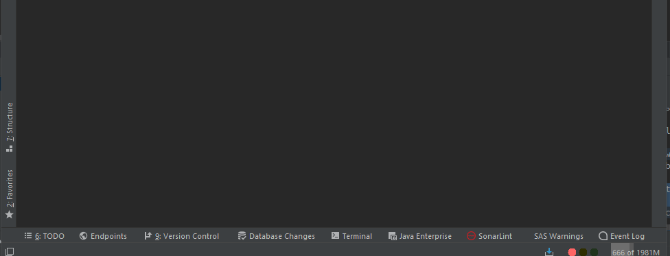

 

# Swiss-AS Dev-Tools
An IntelliJ Plugin used for developers at Swiss-AS.

Please note that this plugin will NOT work outside of the company as it uses integration tools and specific internal URLS.

**The Plugin adds following features to IntelliJ :**

*   A Traffic Light will be shown in the bottom of IntelliJ to indicate the status of the build server with different color code.
Bulbs can be on/off/blinking and multiple bulbs can be turned on the same time.

*   Information about 4LC (class owner, contextual menu or annotation gutter)

 
*   Some pre-commit check to avoid committing without description and to warn developers if they try to commit when the build is not green

*   An important pre-commit dialog wher you can write an E-Mail to QA/Support/Trainer to inform them about graphical changes

*   A Warning Zone where all warnings detected by the Server will be shown.

*   Some automatic code correction to comply with the company standards (ex : "this" before a local variable), based on the source code of intellij-plugin-save-actions

*   A smart way to automatically generate Internal Translation

*   An Action to open the support case / review number corresponding to a given annotation directly in AMOS or review board

*   A setting menu wher the plugin can be configured

Even if this plugin is no use for people outside of Swiss-AS, this project is public as it may help other doing the same kind of plugin
